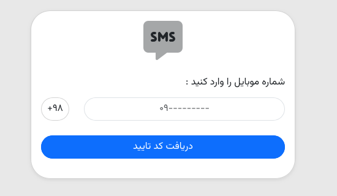
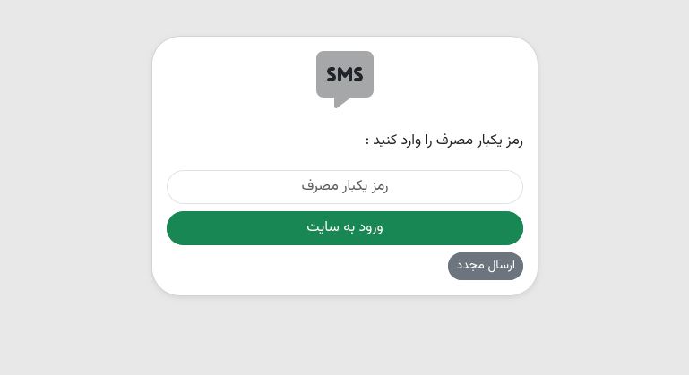

<div align="center">
    <a href="https://github.com/Rayiumir/Vordia" target="_blank">
        
    </a>
</div>
<br>
<div align="center">
    
    
    
    
    
    
</div>

<div align="center">
    <h3>Documentation</h3>
    <a href="./SMS_API_KEY.md">SMS API KEYS</a>
</div>

# Vordia

A simple and lightweight mobile authentication package for Laravel And it has a default admin panel.

# How to use

Install Package :

```bash
composer require rayiumir/vordia
```

After Publish Config Files:

```bash
php artisan vendor:publish --provider="Rayiumir\\Vordia\\ServiceProvider\\VordiaServiceProvider"
```

And Migration Database:

```bash
php artisan migrate
```

Added Fields in Model `user.php` :

```php
protected $fillable = 
[
  'name',
  'email',
  'password',
  'mobile',
  'otp',
  'login_token'
];
```
# List of SMS Operator

<table>
    <thead>
        <tr>
            <th>SMS Operator</th>
            <th>Link</th>
        </tr>
    </thead>
    <tbody>
        <tr>
            <td>SMSIR</td>
            <td><a href="https://sms.ir">https://sms.ir</a></td>
        </tr>
        <tr>
            <td>Ghasedak</td>
            <td><a href="https://ghasedak.me">https://ghasedak.me</a></td>
        </tr>
        <tr>
            <td>Melipayamak</td>
            <td><a href="https://www.melipayamak.com">https://www.melipayamak.com</a></td>
        </tr>
    </tbody>
</table>

# Screenshots

<table class="table">
  <thead>
    <tr>
      <th scope="col" width="1000px">Login Mobile</th>
      <th scope="col" width="1000px">Check OTP Login Mobile</th>
    </tr>
  </thead>
  <tbody>
    <tr>
      <td>
        
      </td>
      <td>
        
      </td>
    </tr>
  </tbody>
</table>
